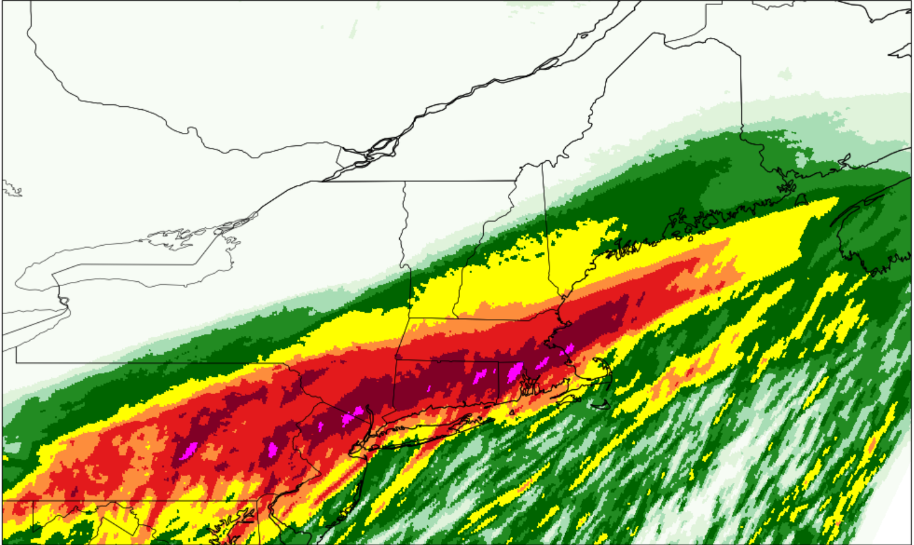

# Daniel's Prototype Cookbook



[](https://github.com/ProjectPythia/cookbook-template/actions/workflows/nightly-build.yaml)
[](https://binder.projectpythia.org/v2/gh/ProjectPythia/cookbook-template/main?labpath=notebooks)
[](https://zenodo.org/badge/latestdoi/475509405)


This Cookbook covers Utilizing ERA5 Reanalysis, as well as comparing HRRR modeled QPF to Stage IV QPE, in this case for Hurricane Ida.

## Motivation

This cookbook shows that a combination of Reanalysis, Model QPF, and observed QPE can be used to gain a better context for Hurricane Ida's impac ton the New York City area. Utilizing these meteorological analysis tools will porvide me more experience pulling from remote datasets, as well as learning how to regrid observations to match model data for comparison. 

## Authors

Daniel Harkin - https://github.com/dh512351 


### Contributors 

Ariel Fuller - 
Kimberly Riek - 

## Structure

This cookbook is designed with two sections: An ERA5 Analysis of the event, and a comparison of HRRR model data to the observed precipitation

### Section 1 ( ERA5 Analysis )

A Reanalysis of Hurricane Ida as it traveled near New York City, including upper-level forcing, surface winds, and precipitation is shown for the 24 hours surrounding the event. 

### Section 2 ( HRRR vs. Stage IV Analysis )

Using a 24 hour event window, all HRRR model QPF forecasts covering the event period are compared to Stage IV QPE for the same 24 hour period, in order to show how well predicted the strong rainfall over New York City was. 

## Running the Notebooks

You can either run the notebook using [Binder](https://binder.projectpythia.org/) or on your local machine.

### Running on Binder

The simplest way to interact with a Jupyter Notebook is through
[Binder](https://binder.projectpythia.org/), which enables the execution of a
[Jupyter Book](https://jupyterbook.org) in the cloud. The details of how this works are not
important for now. All you need to know is how to launch a Pythia
Cookbooks chapter via Binder. Simply navigate your mouse to
the top right corner of the book chapter you are viewing and click
on the rocket ship icon, (see figure below), and be sure to select
“launch Binder”. After a moment you should be presented with a
notebook that you can interact with. I.e. you’ll be able to execute
and even change the example programs. You’ll see that the code cells
have no output at first, until you execute them by pressing
{kbd}`Shift`\+{kbd}`Enter`. Complete details on how to interact with
a live Jupyter notebook are described in [Getting Started with
Jupyter](https://foundations.projectpythia.org/foundations/getting-started-jupyter).

Note, not all Cookbook chapters are executable. If you do not see
the rocket ship icon, such as on this page, you are not viewing an
executable book chapter.


### Running on Your Own Machine

If you are interested in running this material locally on your computer, you will need to follow this workflow:

(Replace "cookbook-example" with the title of your cookbooks)

1. Clone the `https://github.com/ProjectPythia/cookbook-example` repository:

   ```bash
    git clone https://github.com/ProjectPythia/cookbook-example.git
   ```

1. Move into the `cookbook-example` directory
   ```bash
   cd cookbook-example
   ```
1. Create and activate your conda environment from the `environment.yml` file
   ```bash
   conda env create -f environment.yml
   conda activate cookbook-example
   ```
1. Move into the `notebooks` directory and start up Jupyterlab
   ```bash
   cd notebooks/
   jupyter lab
   ```
